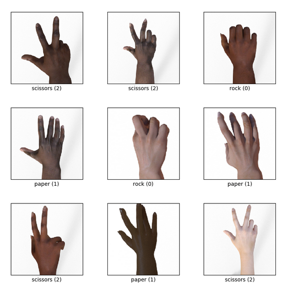

# rock_paper_scissors
 
Tensorflow datasets: rock_paper_scissors dataseti

Rock_paper_scissors dataseti har bitta klassi 964 ta rasmdan iborat bo'lgan 3 ta klassli tosh-qog'oz-o'yini uchun qo'l rasmlaridan tashkil topgan.Rasmlar 300x300 piksel.Dataset parametrlari:

Versiya : 3.0.0

Manba : https://www.tensorflow.org/datasets/catalog/rock_paper_scissors

Dataset hajmi : 219.23 MB

Tensorboardga har bir epochdagi accuracy va loss qiymatlari saqlangan 

Streamlit deploy
