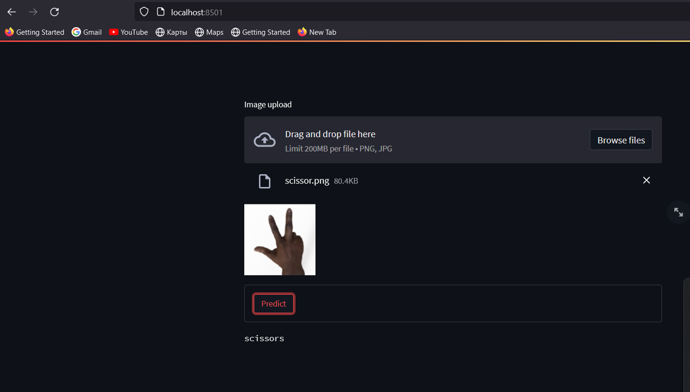
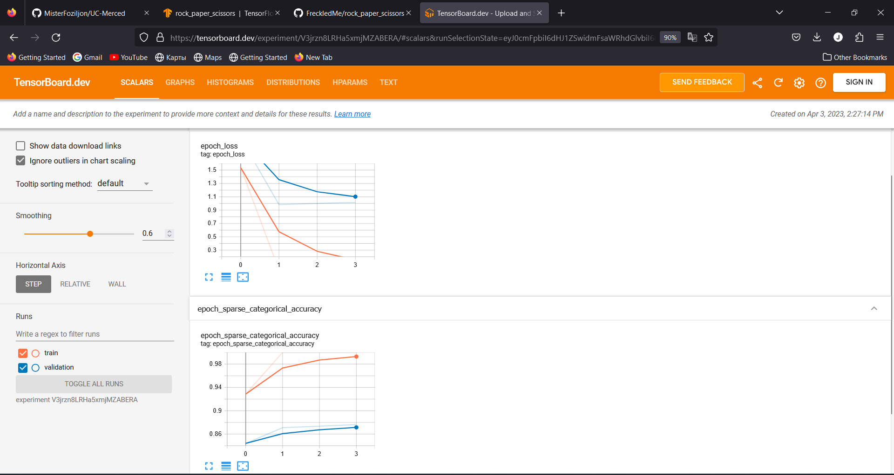

<a name="readme-top"></a>

[![LinkedIn][linkedin-shield]][linkedin-url]


<!-- PROJECT LOGO -->
<br />
<div align="center">
  <a href="https://github.com/FreckledMe/rock_paper_scissors">
    
  </a>


  <p align="center">
    From catalog of tensorflow datasets
  </p>
</div>


<!-- TABLE OF CONTENTS -->
<details>
  <summary>Table of Contents</summary>
  <ol>
    <li>
      <a href="#about-the-project">About The Project</a>
      <ul>
        <li><a href="#built-with">Built With</a></li>
      </ul>
      <ul>
        <li><a href="#installation">Installation</a></li>
      </ul>
    </li>
    <li><a href="#contact">Contact</a></li>
  </ol>
</details>


<!-- ABOUT THE PROJECT -->
## About The Project


Rock Paper Scissors contains images from various hands, from different races, ages, and genders, posed into Rock / Paper or Scissors and labeled as such. You can download the training set here and the test set here. I created these images using CGI techniques as an experiment in determining if a model trained on a CGI-based dataset could classify real images. I also generated a few pictures that you can use for predictions. You can find them here.

Note that all of these pictures use a plain white background. Each image is 300×300 pixels in 24-bit color. Examples Here are a few examples showing some of the poses and the diversity of hands used. 

License

The dataset is licensed as a CC By 2.0, free for you to share and adapt for all uses, commercial or non-commercial. Please attribute and give appropriate credit to Laurence Moroney (lmoroney@gmail.com / laurencemoroney.com), and place no additional restrictions on your users as outlined here.

![Product Name Screen Shot][product-screenshot]

<p align="right">(<a href="#readme-top">back to top</a>)</p>


### Built With

* [![Python][Python]][Python-url]
* [![Tensorflow][Tensorflow]][T-url]
* [![Jupyter Notebook][Jupyter]][J-url]
* <a href="https://streamlit.io/"> </a>
<p align="right">(<a href="#readme-top">back to top</a>)</p>
 


### Installation


1. Clone the repo and extract zip file
   ```sh
   git clone https://github.com/FreckledMe/rock_paper_scissors.git
   ```
2. Open a terminal via this extracted folder location
   ```sh
   pip install virtualenv
   ```
3. Create environment for project
   ```sh
   python<version> -m venv <virtual-environment-name>
   ```
4. Activate environment
   ```sh
   environment_path\<virtual-environment-name>\Scripts\activate
   ```
5. Install required libraries
   ```sh
   (virtual-environment-name) pip install -r requirements.txt
   ```
6. Run [rock_paper_scissors.ipynb ](https://github.com/FreckledMe/rock_paper_scissors/blob/main/rock_paper_scissors.ipynb)

<p align="right">(<a href="#readme-top">back to top</a>)</p>


<!-- USAGE EXAMPLES -->
## Usage
   Use [Streamlit](https://github.com/streamlit/streamlit)
   ```sh 
   (virtual-environment-name)/streamlit run stream.py
   ```
Example result



   View loss and accuracy in per epoch via [Tensorboard](https://github.com/tensorflow/tensorboard)
   ```sh
   tensorboard --logdir logs
   ```
Example result




Use this space to show useful examples of how a project can be used. Additional screenshots, code examples and demos work well in this space. You may also link to more resources.

_For more examples, please refer to the [Documentation](https://example.com)_

<p align="right">(<a href="#readme-top">back to top</a>)</p>


<!-- MARKDOWN LINKS & IMAGES -->

[linkedin-shield]: https://img.shields.io/badge/-LinkedIn-black.svg?style=for-the-badge&logo=linkedin&colorB=555
[linkedin-url]: https://www.linkedin.com/in/kamoliddin-jabbarov-599b56201/
[product-screenshot]: images/screenshot.png

[Python]: https://staging.python.org/static/community_logos/python-powered-w-70x28.png
[Python-url]: https://python.org/
[Tensorflow]:  https://img.shields.io/badge/TensorFlow-FF6F00?style=for-the-badge&logo=tensorflow&logoColor=white
[T-url]: https://www.tensorflow.org/
[Jupyter]: https://img.shields.io/badge/jupyter-%23FA0F00.svg?style=for-the-badge&logo=jupyter&logoColor=white
[J-url]: https://jupyter.org/